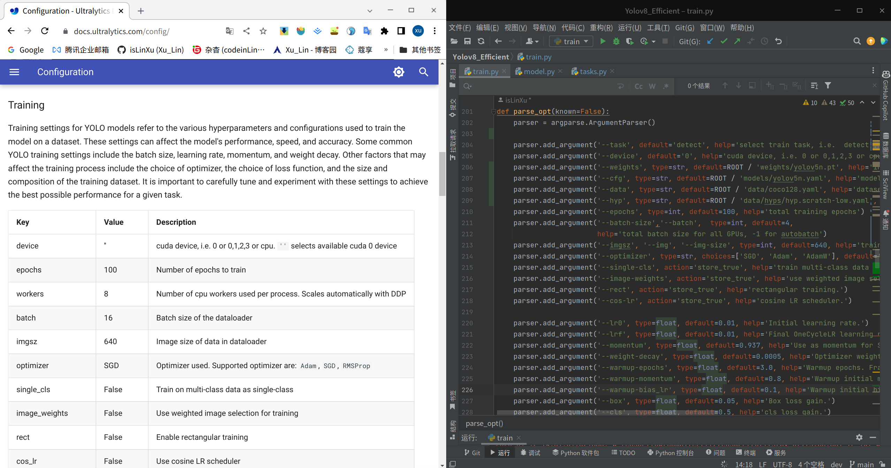
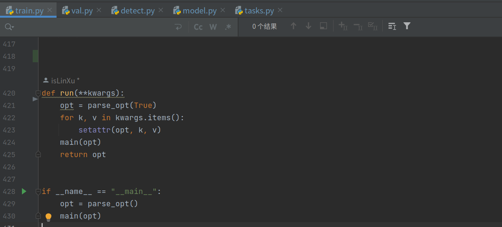
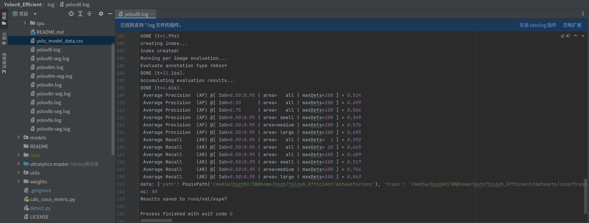
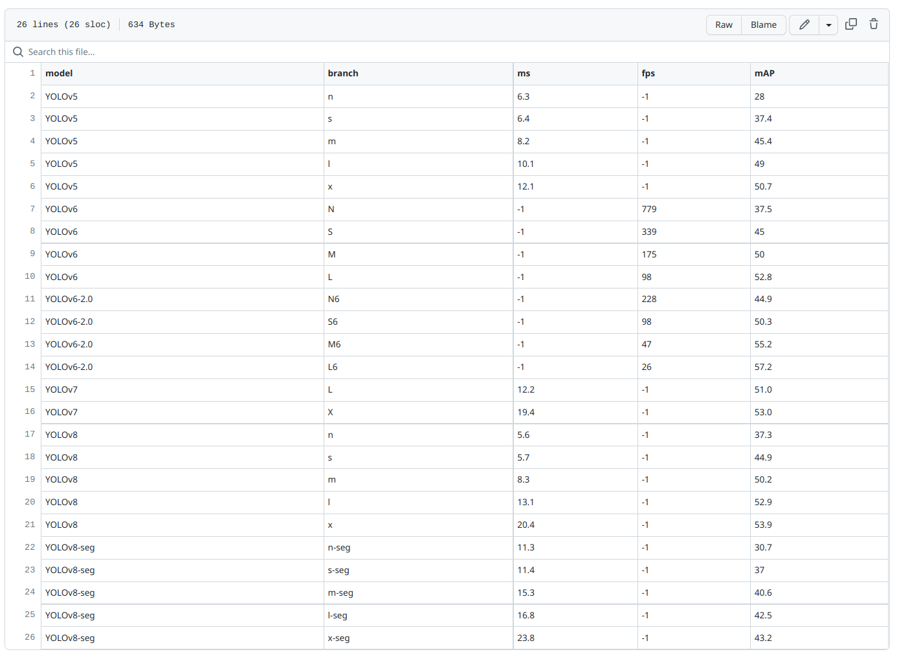
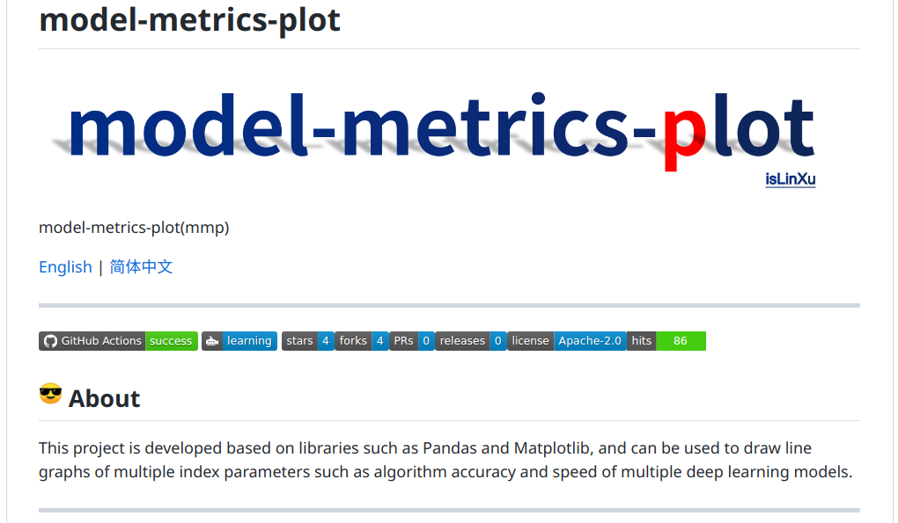

# Yolov8_Efficient


Simple and efficient use for yolov8

[English](README.md) | [简体中文](README.zh-CN.md)


---


 
 
[](https://github.com/isLinXu/Yolov8_Efficient)      


## 😎 About

This is an unofficial repository maintained by independent developers for learning and communication based on the ultralytics v8 Weights and ultralytics Project.
If you have more questions and ideas, please feel free to discuss them together. 
In addition, ultralytics has released the latest [ultralytics](https://github.com/ultralytics/ultralytics) repository, and it is recommended to use the official one first.

This project is based on ultralytics and yolov5 for comprehensive reference, and is committed to making the yolo series more efficient and easy to use.

Currently doing the following work:

- Referring to the Configuration parameters in https://docs.ultralytics.com/config/, the configuration alignment of corresponding parameters has been made for train.py, detect.py, val.py, etc.

> 

- Combined with yolov5's usage habits and code structure, it is compatible and optimized

> 


- By verifying and calculating the weights of the index parameters on the coco dataset on their own machine, experimental records are stored:https://github.com/isLinXu/YOLOv8_Efficient/tree/main/log.

  > 

- Experimental data are recorded in:https://github.com/isLinXu/YOLOv8_Efficient/blob/main/log/yolo_model_data.csv
  > 

  

- According to the calculated results, the corresponding index parameter comparison chart is drawn, this drawing program is also open source：https://github.com/isLinXu/model-metrics-plot。

  > 

- integration and configuration with other network model structures is in progress...


## 🥰Performance

### Metrics


### structure 


> Thanks to [jizhishutong](https://github.com/jizhishutong) for providing model structure diagrams for this project.


- wandb train log:  [log](https://wandb.ai/glenn-jocher/YOLOv8)
- Experiment log: [log](https://github.com/isLinXu/YOLOv8_Efficient/tree/main/log)


## 🆕News!

---

- ... ...
- 2023/01/16 - add train_detect, train_cls and train_seg
- 2023/01/10 - add yolov8 metrics and logs
- 2023/01/09 - add val.py and fix some error
- 2023/01/07 - fix some error and warning 
- 2023/01/06 - add train.py, detect.py and README.md
- 2023/01/06 - Create and Init a new repository


## 🤔 TODO：

- [x] Model testing and validation in progress
- [ ] 


## 🧙‍Quickstart

- **Documentation**

  [**Ultralytics YOLO Docs**](https://docs.ultralytics.com/)

- [ultralytics assets releases](https://github.com/ultralytics/assets/releases/)


### 1. CLI

To simply use the latest Ultralytics YOLO models

```bash
yolo task=detect    mode=train    model=yolov8n.yaml      args=...
          classify       predict        yolov8n-cls.yaml  args=...
          segment        val            yolov8n-seg.yaml  args=...
                         export         yolov8n.pt        format=onnx
```

### 2. Python SDK

To use pythonic interface of Ultralytics YOLO model

```python
from ultralytics import YOLO

model = YOLO("yolov8n.yaml")  # create a new model from scratch
model = YOLO(
    "yolov8n.pt"
)  # load a pretrained model (recommended for best training results)
results = model.train(data="coco128.yaml", epochs=100, imgsz=640, ...)
results = model.val()
results = model.predict(source="bus.jpg")
success = model.export(format="onnx")
```

If you're looking to modify YOLO for R&D or to build on top of it, refer to https://docs.ultralytics.com/.


### 3.Train custom datasets

Here take coco128 as an example：

- 1.To make data sets in YOLO format, you can divide and transform data sets by `prepare_data.py` in the project directory.
  
- 2.Modify the `.yaml` of the corresponding model weight in `config`, configure its data set path, and read the data loader.
- 3.To modify the corresponding parameters in the model, it is mainly to modify the number of categories and network structure parameters. If it is only a simple application, it is not recommended to modify the following network structure parameters, but only the number of nc categories
- 4.Run `train.py`, this step can be modified under the corresponding variable in `parse_opt`, which needs to be configured according to equipment and training needs, including `device`, `task`, `data`, `weights`,`epochs`, `batch_size`, etc. If this parameter is not specified, the default parameter is used.


## 🧙‍Pretrained Checkpoints

|                            Model                             | size (pixels) | mAPval 50-95 | mAPval 50 | Speed CPU b1 (ms) | Speed RTX 3080 b1(ms) | layers | params (M) | FLOPs @640 (B) |
| :----------------------------------------------------------: | :-----------: | :----------: | :-------: | :---------------: | :-------------------: | :----: | :--------: | :------------: |
| [yolov8n](https://github.com/ultralytics/assets/releases/download/v0.0.0/yolov8n.pt) |      640      |     37.2     |   53.2    |       47.2        |          5.6          |  168   |    3.15    |      8.7       |
| [yolov8n-seg](https://github.com/ultralytics/assets/releases/download/v0.0.0/yolov8n-seg.pt) |      640      |     30.7     |   50.0    |       59.3        |         11.3          |  195   |    3.40    |      12.6      |
| [yolov8s](https://github.com/ultralytics/assets/releases/download/v0.0.0/yolov8s.pt) |      640      |     44.7     |   62.2    |       87.9        |          5.7          |  168   |   11.15    |      28.6      |
| [yolov8s-seg](https://github.com/ultralytics/assets/releases/download/v0.0.0/yolov8s-seg.pt) |      640      |     37.0     |   58.8    |       107.6       |         11.4          |  195   |   11.81    |      42.6      |
| [yolov8m](https://github.com/ultralytics/assets/releases/download/v0.0.0/yolov8m.pt) |      640      |     49.9     |   67.4    |       185.6       |          8.3          |  218   |   25.89    |      78.9      |
| [yolov8m-seg](https://github.com/ultralytics/assets/releases/download/v0.0.0/yolov8m-seg.pt) |      640      |     40.6     |   63.5    |       207.7       |         15.3          |  245   |   27.27    |     110.2      |
| [yolov8l](https://github.com/ultralytics/assets/releases/download/v0.0.0/yolov8l.pt) |      640      |     52.4     |   69.9    |       319.6       |         13.1          |  268   |   43.67    |     165.2      |
| [yolov8l-seg](https://github.com/ultralytics/assets/releases/download/v0.0.0/yolov8l-seg.pt) |      640      |     42.5     |   66.1    |       296.9       |         16.8          |  295   |   45.97    |     220.5      |
| [yolov8x](https://github.com/ultralytics/assets/releases/download/v0.0.0/yolov8x.pt) |      640      |     53.5     |   70.9    |       334.6       |         20.4          |  268   |   68.20    |     257.8      |
| [yolov8x-seg](https://github.com/ultralytics/assets/releases/download/v0.0.0/yolov8x-seg.pt) |      640      |     43.2     |   67.1    |       418.8       |         23.8          |  295   |   71.80    |     344.1      |

> **Table Notes**
> The above data is generated by running tests in the following configured environment. See below for details.
>
> - GPU: NVIDIA GeForce RTX 3080/PCIe/SSE2
> - CPU: Intel® Core™ i9-10900K CPU @ 3.70GHz × 20
> - Memory: 31.3 GiB
> - System: Ubuntu 18.04 LTS
> - (ms): The statistical speed here is inference speed


## Install

### pip install

```bash
pip install ultralytics
```

### Development

```shell
git clone git@github.com:isLinXu/YOLOv8_Efficient.git
cd YOLOv8_Efficient
cd ultralytics-master
pip install -e .
```


## 🔨Usage

### Train

- Single-GPU training:

```shell
python train.py --data coco128.yaml --weights weights/yolov8ns.pt --img 640  # from pretrained (recommended)
```

```python
python train.py --data coco128.yaml --weights '' --cfg yolov8ns.yaml --img 640  # from scratch
```

> Use IDE Pycharm
>
> 


  - Multi-GPU DDP training:
```shell
    python -m torch.distributed.run --nproc_per_node 4 --master_port 1 train.py --data coco128.yaml --weights yolov8ns.pt --img 640 --device 0,1,2,3
```

​    

### detect

```shell
python detect.py --weights yolov8s.pt --source 0                               # webcam
                                                     img.jpg                         # image
                                                     vid.mp4                         # video
                                                     screen                          # screenshot
                                                     path/                           # directory
                                                     list.txt                        # list of images
                                                     list.streams                    # list of streams
                                                     'path/*.jpg'                    # glob
                                                     'https://youtu.be/Zgi9g1ksQHc'  # YouTube
                                                     'rtsp://example.com/media.mp4'  # RTSP, RTMP, HTTP stream
```

> Use IDE Pycharm
>
> 


### val

- i.e coco128:

>|  |  |           |
> | ------------------------------ | ----------------------- | ------------------------------- |
>|         |   |  |

#### Usage:

```shell
python val.py --weights yolov8n.pt --data coco128.yaml --img 640
```

#### Usage - formats:


```shell
python val.py --weights yolov8s.pt                 # PyTorch
                              yolov8s.torchscript        # TorchScript
                              yolov8s.onnx               # ONNX Runtime or OpenCV DNN with --dnn
                              yolov8s_openvino_model     # OpenVINO
                              yolov8s.engine             # TensorRT
                              yolov8s.mlmodel            # CoreML (macOS-only)
                              yolov8s_saved_model        # TensorFlow SavedModel
                              yolov8s.pb                 # TensorFlow GraphDef
                              yolov8s.tflite             # TensorFlow Lite
                              yolov8s_edgetpu.tflite     # TensorFlow Edge TPU
                              yolov8s_paddle_model       # PaddlePaddle
```

> Use IDE Pycharm
> 


## 🌹Acknowledgements
- [https://github.com/ultralytics/yolov3](https://github.com/ultralytics/yolov3)
- [https://github.com/ultralytics/yolov5](https://github.com/ultralytics/yolov5)
- https://github.com/meituan/YOLOv6
- https://github.com/WongKinYiu/yolov7

