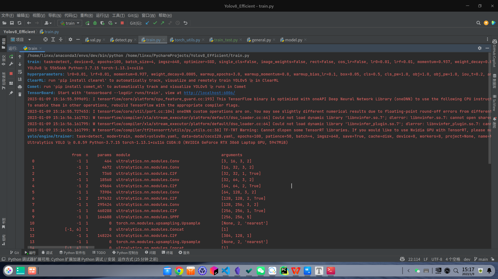

# Yolov8_Efficient


Simple and efficient use for yolov8

---

[](https://github.com/isLinXu/Yolov8_Efficient)  


## Demo


## Quickstart

```shell
python3 detect.py
```


## Install

### pip install

```bash
pip install ultralytics
```

### Development

```shell
git clone git@github.com:isLinXu/YOLOv8_Efficient.git
cd YOLOv8_Efficient
cd ultralytics
pip install -e .
```


## Usage

### Train

- Single-GPU training:

```shell
python train.py --data coco128.yaml --weights weights/yolov8ns.pt --img 640  # from pretrained (recommended)
```

```python
python train.py --data coco128.yaml --weights '' --cfg yolov8ns.yaml --img 640  # from scratch
```

> Use IDE Pycharm
>
> 


  - Multi-GPU DDP training:
    
```shell
    python -m torch.distributed.run --nproc_per_node 4 --master_port 1 train.py --data coco128.yaml --weights yolov8ns.pt --img 640 --device 0,1,2,3
```

​    

### detect

```shell
python detect.py --weights yolov8s.pt --source 0                               # webcam
                                                     img.jpg                         # image
                                                     vid.mp4                         # video
                                                     screen                          # screenshot
                                                     path/                           # directory
                                                     list.txt                        # list of images
                                                     list.streams                    # list of streams
                                                     'path/*.jpg'                    # glob
                                                     'https://youtu.be/Zgi9g1ksQHc'  # YouTube
                                                     'rtsp://example.com/media.mp4'  # RTSP, RTMP, HTTP stream
```

> Use IDE Pycharm
>
> 


### val


