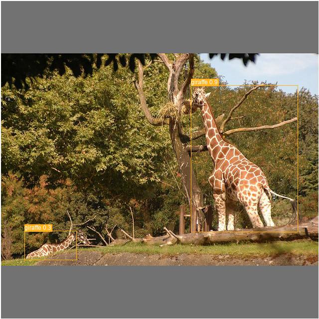
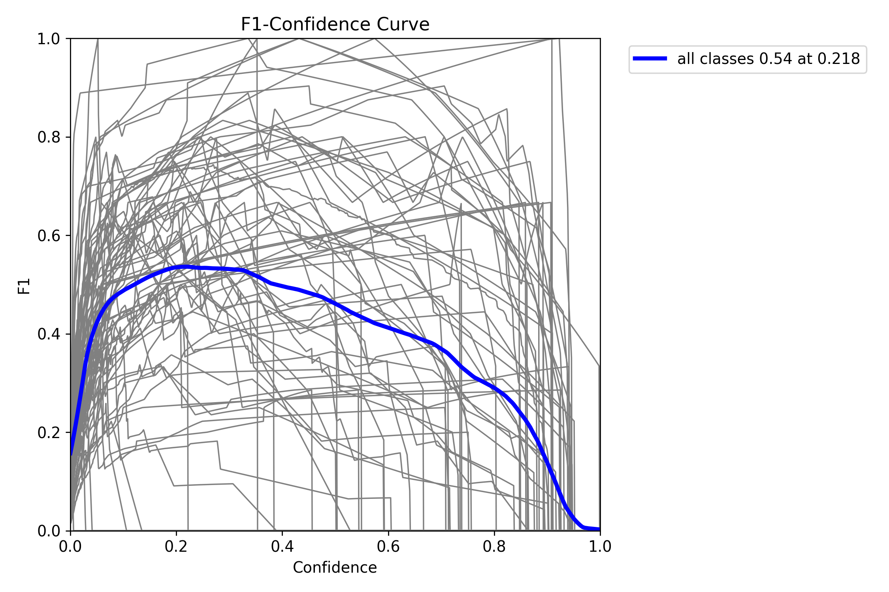
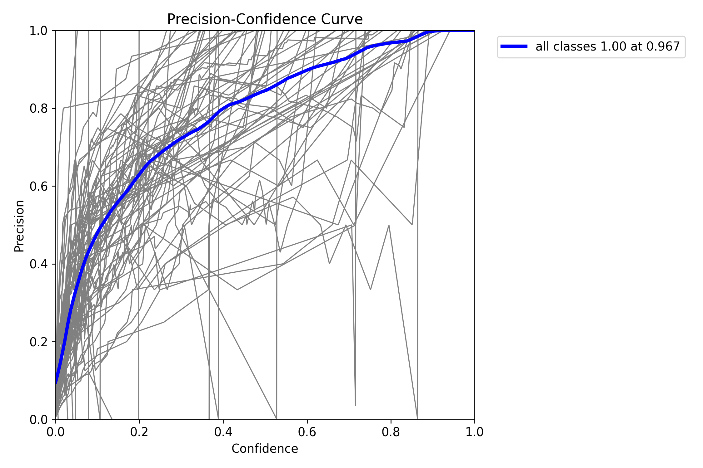

# Yolov8_Efficient


Simple and efficient use for yolov8


---

[](https://github.com/isLinXu/Yolov8_Efficient)  


## About

This is an unofficial repository maintained by independent developers for learning and communication based on the ultralytics v8 Weights and ultralytics Project.
If you have more questions and ideas, please feel free to discuss them together. In addition, if ultralytics releases the latest yolov8 warehouse, it is suggested to give priority to the official one.


## Performance


- wandb train log:  [log](https://wandb.ai/glenn-jocher/YOLOv8)
- Experiment log: [log](https://github.com/isLinXu/YOLOv8_Efficient/tree/main/log)


## New's
- ... ...
- 2023/01/10 - add yolov8 metrics and logs
- 2023/01/09 - add val.py and fix some error
- 2023/01/07 - fix some error and warning 
- 2023/01/06 - add train.py, detect.py and README.md
- 2023/01/06 - Create and Init a new repository

## Quickstart

- **Documentation**

  [**Ultralytics YOLO Docs**](https://v8docs.ultralytics.com/sdk/)

- [ultralytics assets releases](https://github.com/ultralytics/assets/releases/)


### 1. CLI

To simply use the latest Ultralytics YOLO models

```bash
yolo task=detect    mode=train    model=yolov8n.yaml      args=...
          classify       predict        yolov8n-cls.yaml  args=...
          segment        val            yolov8n-seg.yaml  args=...
                         export         yolov8n.pt        format=onnx
```

### 2. Python SDK

To use pythonic interface of Ultralytics YOLO model

```python
from ultralytics import YOLO

model = YOLO("yolov8n.yaml")  # create a new model from scratch
model = YOLO(
    "yolov8n.pt"
)  # load a pretrained model (recommended for best training results)
results = model.train(data="coco128.yaml", epochs=100, imgsz=640, ...)
results = model.val()
results = model.predict(source="bus.jpg")
success = model.export(format="onnx")
```

If you're looking to modify YOLO for R&D or to build on top of it, refer to [Using Trainer](<>) Guide on our docs.


### Pretrained Checkpoints

|                            Model                             | size (pixels) | mAPval 50-95 | mAPval 50 | Speed CPU b1 (ms) | Speed RTX 3080 (ms) | params (M) | FLOPs @640 (B) |
| :----------------------------------------------------------: | :-----------: | :----------: | :-------: | :---------------: | :-----------------: | :--------: | :------------: |
| [yolov8n](https://github.com/ultralytics/assets/releases/download/v0.0.0/yolov8n.pt) |      640      |     37.2     |   53.2    |         -         |         5.6         |     -      |       -        |
| [yolov8n-seg](https://github.com/ultralytics/assets/releases/download/v0.0.0/yolov8n-seg.pt) |      640      |      -       |     -     |         -         |          -          |     -      |       -        |
| [yolov8s](https://github.com/ultralytics/assets/releases/download/v0.0.0/yolov8s.pt) |      640      |     44.7     |   62.2    |         -         |         5.7         |            |                |
| [yolov8-seg](https://github.com/ultralytics/assets/releases/download/v0.0.0/yolov8s-seg.pt) |      640      |      -       |     -     |         -         |          -          |     -      |       -        |
| [yolov8m](https://github.com/ultralytics/assets/releases/download/v0.0.0/yolov8m.pt) |      640      |     49.9     |   67.4    |         -         |         8.3         |     -      |       -        |
| [yolov8m-seg](https://github.com/ultralytics/assets/releases/download/v0.0.0/yolov8m-seg.pt) |      640      |      -       |     -     |         -         |          -          |     -      |       -        |
| [yolov8l](https://github.com/ultralytics/assets/releases/download/v0.0.0/yolov8l.pt) |      640      |     52.4     |   69.9    |         -         |        13.1         |     -      |       -        |
| [yolov8l-seg](https://github.com/ultralytics/assets/releases/download/v0.0.0/yolov8l-seg.pt) |      640      |      -       |     -     |         -         |          -          |     -      |       -        |
| [yolov8x](https://github.com/ultralytics/assets/releases/download/v0.0.0/yolov8x.pt) |      640      |     53.5     |   70.9    |         -         |        20.4         |     -      |       -        |
| [yolov8x-seg](https://github.com/ultralytics/assets/releases/download/v0.0.0/yolov8x-seg.pt) |      640      |      -       |     -     |         -         |          -          |     -      |       -        |

- TODO：Model testing and validation in progress


## Install

### pip install

```bash
pip install ultralytics
```

### Development

```shell
git clone git@github.com:isLinXu/YOLOv8_Efficient.git
cd YOLOv8_Efficient
cd ultralytics-master
pip install -e .
```


## Usage

### Train

- Single-GPU training:

```shell
python train.py --data coco128.yaml --weights weights/yolov8ns.pt --img 640  # from pretrained (recommended)
```

```python
python train.py --data coco128.yaml --weights '' --cfg yolov8ns.yaml --img 640  # from scratch
```

> Use IDE Pycharm
>
> 


  - Multi-GPU DDP training:
```shell
    python -m torch.distributed.run --nproc_per_node 4 --master_port 1 train.py --data coco128.yaml --weights yolov8ns.pt --img 640 --device 0,1,2,3
```

​    

### detect

```shell
python detect.py --weights yolov8s.pt --source 0                               # webcam
                                                     img.jpg                         # image
                                                     vid.mp4                         # video
                                                     screen                          # screenshot
                                                     path/                           # directory
                                                     list.txt                        # list of images
                                                     list.streams                    # list of streams
                                                     'path/*.jpg'                    # glob
                                                     'https://youtu.be/Zgi9g1ksQHc'  # YouTube
                                                     'rtsp://example.com/media.mp4'  # RTSP, RTMP, HTTP stream
```

> Use IDE Pycharm
>
> 


### val

- i.e coco128:

>|  |  |           |
> | ------------------------------ | ----------------------- | ------------------------------- |
>|         |   |  |

#### Usage:

```shell
python val.py --weights yolov8n.pt --data coco128.yaml --img 640
```

#### Usage - formats:


```shell
python val.py --weights yolov8s.pt                 # PyTorch
                              yolov8s.torchscript        # TorchScript
                              yolov8s.onnx               # ONNX Runtime or OpenCV DNN with --dnn
                              yolov8s_openvino_model     # OpenVINO
                              yolov8s.engine             # TensorRT
                              yolov8s.mlmodel            # CoreML (macOS-only)
                              yolov8s_saved_model        # TensorFlow SavedModel
                              yolov8s.pb                 # TensorFlow GraphDef
                              yolov8s.tflite             # TensorFlow Lite
                              yolov8s_edgetpu.tflite     # TensorFlow Edge TPU
                              yolov8s_paddle_model       # PaddlePaddle
```

> Use IDE Pycharm
> 


## Acknowledgements

<details><summary> <b>Expand</b> </summary>
* [https://github.com/ultralytics/yolov3](https://github.com/ultralytics/yolov3)
* [https://github.com/ultralytics/yolov5](https://github.com/ultralytics/yolov5)
</details>
