# Yolov8_Efficient

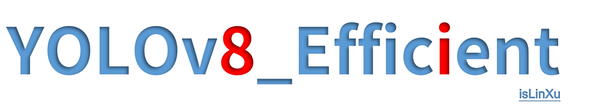

简单高效的使用YOLOv8

[English](README.md) | [简体中文](README.zh-CN.md)

---

   
 [](https://github.com/isLinXu/Yolov8_Efficient)      

## 😎 介绍

这是一个由独立开发人员维护的非官方存储库，用于基于 ultralytics v8 Weights 和 ultralytics Project 的学习和交流。如果大家有更多的问题和想法，欢迎大家一起讨论。
另外，ultralytics已发布了最新的[ultralytics](https://github.com/ultralytics/ultralytics)仓库，建议优先使用官方的。

本项目基于ultralytics及yolov5等进行综合参考，致力于让yolo系列的更加高效和易用。

目前主要做了以下的工作：

- 参考https://docs.ultralytics.com/config/中的Configuration参数，分别针对train.py、detect.py、val.py等做了相应参数的配置对齐。

> 


- 结合yolov5的使用习惯以及代码结构做了兼容和优化。

  > 
  >
  > 

- 通过在coco数据集上在自己的机器上进行验证和计算的权重的指标参数，实验记录存放在https://github.com/isLinXu/YOLOv8_Efficient/tree/main/log.实验数据记录在:

  > 
  >
  > 

  

- 根据计算出来的结果绘制了相应的指标参数对比图，这个绘图程序也开源在https://github.com/isLinXu/model-metrics-plot中。

  > 

- 融合其他更多网络模型结构进行集成整合和配置，正在进行中...


## 🥰展示

### 指标

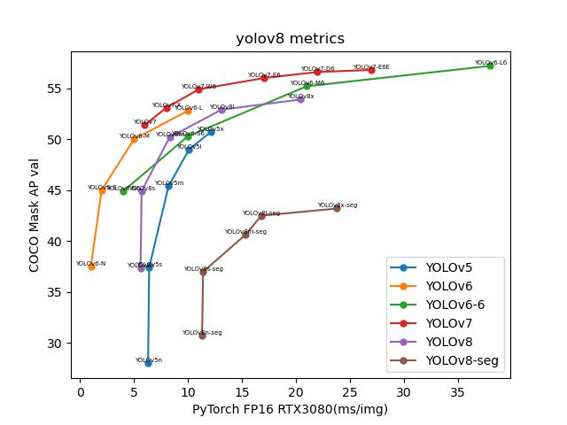

### 网络结构图 

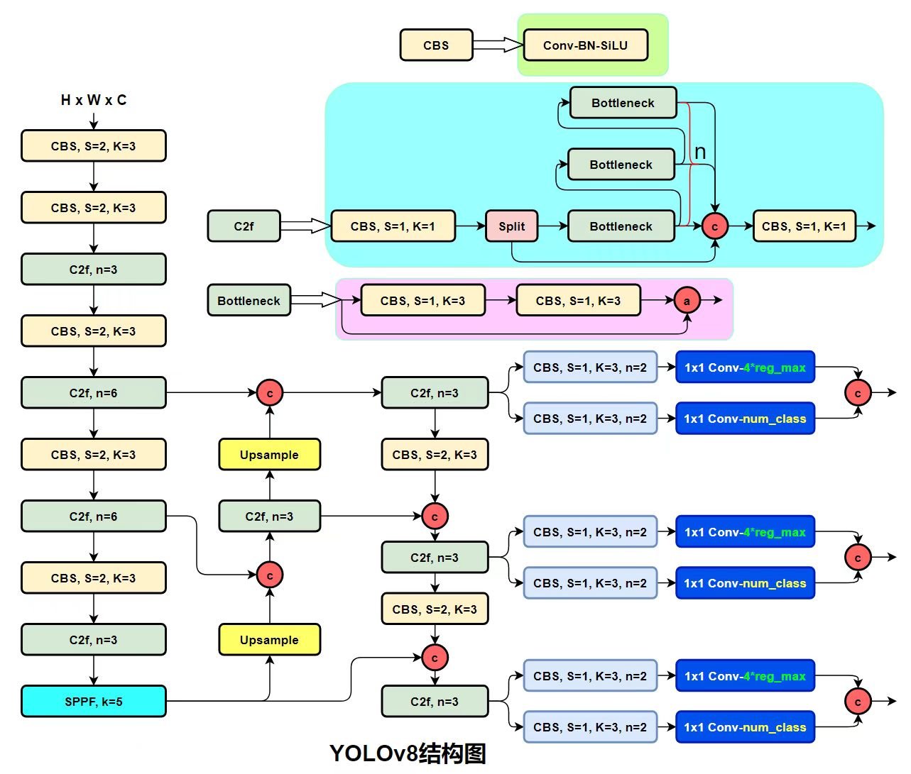

> 这里感谢[集智书童](https://github.com/jizhishutong)为本项目提供的网络结构图


- wandb训练日志:  [log](https://wandb.ai/glenn-jocher/YOLOv8)
- 实验日志: [log](https://github.com/isLinXu/YOLOv8_Efficient/tree/main/log)


## 🆕新闻!

---

- ... ...
- 2023/01/16 - add train_detect, train_cls and train_seg
- 2023/01/11 - add metrics plot and model structure
- 2023/01/10 - add yolov8 metrics and logs
- 2023/01/09 - add val.py and fix some error
- 2023/01/07 - fix some error and warning 
- 2023/01/06 - add train.py, detect.py and README.md
- 2023/01/06 - Create and Init a new repository


## 🤔 任务清单：

- [x] 模型测试和验证中
- [ ] 


## 🧙‍快速开始

- **文档**

  [**Ultralytics YOLO Docs**](https://docs.ultralytics.com/)

- [ultralytics assets releases](https://github.com/ultralytics/assets/releases/)


### 1.命令行执行

简单地使用最新的 Ultralytics YOLO 模型

```bash
yolo task=detect    mode=train    model=yolov8n.yaml      args=...
          classify       predict        yolov8n-cls.yaml  args=...
          segment        val            yolov8n-seg.yaml  args=...
                         export         yolov8n.pt        format=onnx
```

### 2. Python SDK

使用 Ultralytics YOLO 模型的 pythonic 接口

```python
from ultralytics import YOLO

model = YOLO("yolov8n.yaml")  # create a new model from scratch
model = YOLO(
    "yolov8n.pt"
)  # load a pretrained model (recommended for best training results)
results = model.train(data="coco128.yaml", epochs=100, imgsz=640, ...)
results = model.val()
results = model.predict(source="bus.jpg")
success = model.export(format="onnx")
```

如果您希望为研发修改 YOLO 或在其之上构建，请参阅文档https://docs.ultralytics.com/。


### 3.训练自己的数据集

这里以coco128为例。

- 1.制作YOLO格式的数据集，可以通过项目目录中的`prepare_data.py`来进行数据集的划分与转换。
- 2.修改`config`中相应模型权重的`.yaml`，配置其数据集路径，读入数据加载器。
- 3.修改model中相应参数，主要是修改类别数量和网络结构参数，如果只是简单应用，那么不建议修改下面的网络结构参数，只修改其类别数量即可。
- 4.运行train.py，这一步可以到`parse_opt`中对应的变量下进行修改，需要根据设备和训练的需要进行配置，主要包括`device`、`task`、`data`、`weights`、`epochs`、`batch_size`等，如果不配置则使用默认参数。


## 🧙‍预训练检查点

|                            Model                             | size (pixels) | mAPval 50-95 | mAPval 50 | Speed CPU b1 (ms) | Speed RTX 3080 b1(ms) | layers | params (M) | FLOPs @640 (B) |
| :----------------------------------------------------------: | :-----------: | :----------: | :-------: | :---------------: | :-------------------: | :----: | :--------: | :------------: |
| [yolov8n](https://github.com/ultralytics/assets/releases/download/v0.0.0/yolov8n.pt) |      640      |     37.2     |   53.2    |       47.2        |          5.6          |  168   |    3.15    |      8.7       |
| [yolov8n-seg](https://github.com/ultralytics/assets/releases/download/v0.0.0/yolov8n-seg.pt) |      640      |     30.7     |   50.0    |       59.3        |         11.3          |  195   |    3.40    |      12.6      |
| [yolov8s](https://github.com/ultralytics/assets/releases/download/v0.0.0/yolov8s.pt) |      640      |     44.7     |   62.2    |       87.9        |          5.7          |  168   |   11.15    |      28.6      |
| [yolov8s-seg](https://github.com/ultralytics/assets/releases/download/v0.0.0/yolov8s-seg.pt) |      640      |     37.0     |   58.8    |       107.6       |         11.4          |  195   |   11.81    |      42.6      |
| [yolov8m](https://github.com/ultralytics/assets/releases/download/v0.0.0/yolov8m.pt) |      640      |     49.9     |   67.4    |       185.6       |          8.3          |  218   |   25.89    |      78.9      |
| [yolov8m-seg](https://github.com/ultralytics/assets/releases/download/v0.0.0/yolov8m-seg.pt) |      640      |     40.6     |   63.5    |       207.7       |         15.3          |  245   |   27.27    |     110.2      |
| [yolov8l](https://github.com/ultralytics/assets/releases/download/v0.0.0/yolov8l.pt) |      640      |     52.4     |   69.9    |       319.6       |         13.1          |  268   |   43.67    |     165.2      |
| [yolov8l-seg](https://github.com/ultralytics/assets/releases/download/v0.0.0/yolov8l-seg.pt) |      640      |     42.5     |   66.1    |       296.9       |         16.8          |  295   |   45.97    |     220.5      |
| [yolov8x](https://github.com/ultralytics/assets/releases/download/v0.0.0/yolov8x.pt) |      640      |     53.5     |   70.9    |       334.6       |         20.4          |  268   |   68.20    |     257.8      |
| [yolov8x-seg](https://github.com/ultralytics/assets/releases/download/v0.0.0/yolov8x-seg.pt) |      640      |     43.2     |   67.1    |       418.8       |         23.8          |  295   |   71.80    |     344.1      |

> - **表格注释** 以上数据是在以下配置的环境中运行测试生成的。详情见下文。
> - 显卡：NVIDIA GeForce RTX 3080/PCIe/SSE2
> - CPU：Intel® Core™ i9-10900K CPU @ 3.70GHz × 20
> - 内存：31.3 GiB
> - 系统：Ubuntu 18.04 LTS
> - (ms): 这里的统计速度是推理速度


## 安装

### 直接安装

```bash
pip install ultralytics
```

### 配置安装

```shell
git clone git@github.com:isLinXu/YOLOv8_Efficient.git
cd YOLOv8_Efficient
cd ultralytics-master
pip install -e .
```

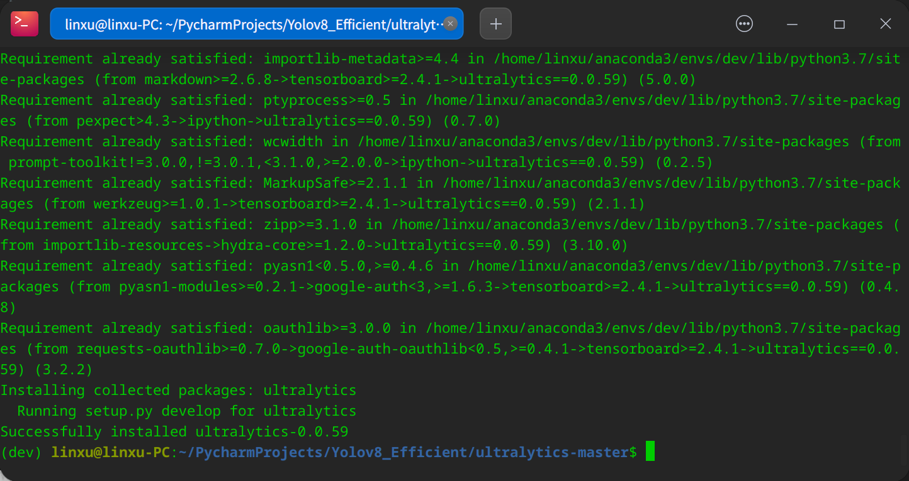

## 🔨用法

### 训练

- 单 GPU 训练:

```shell
python train.py --data coco128.yaml --weights weights/yolov8ns.pt --img 640  # from pretrained (recommended)
```

```python
python train.py --data coco128.yaml --weights '' --cfg yolov8ns.yaml --img 640  # from scratch
```

> 使用 IDE Pycharm
>
> 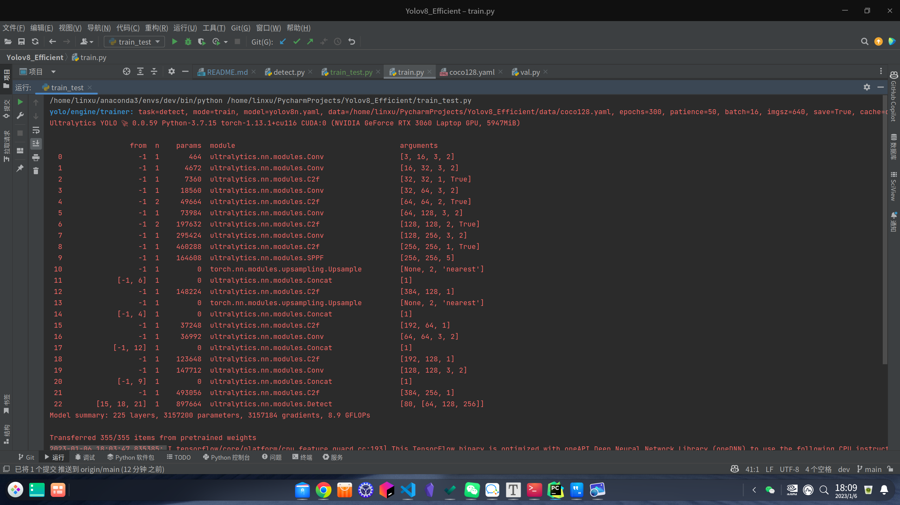


  - 多 GPU DDP 训练：
```shell
    python -m torch.distributed.run --nproc_per_node 4 --master_port 1 train.py --data coco128.yaml --weights yolov8ns.pt --img 640 --device 0,1,2,3
```

​    

### 推理检测

```shell
python detect.py --weights yolov8s.pt --source 0                               # webcam
                                                     img.jpg                         # image
                                                     vid.mp4                         # video
                                                     screen                          # screenshot
                                                     path/                           # directory
                                                     list.txt                        # list of images
                                                     list.streams                    # list of streams
                                                     'path/*.jpg'                    # glob
                                                     'https://youtu.be/Zgi9g1ksQHc'  # YouTube
                                                     'rtsp://example.com/media.mp4'  # RTSP, RTMP, HTTP stream
```

> 使用 IDE Pycharm
>
> 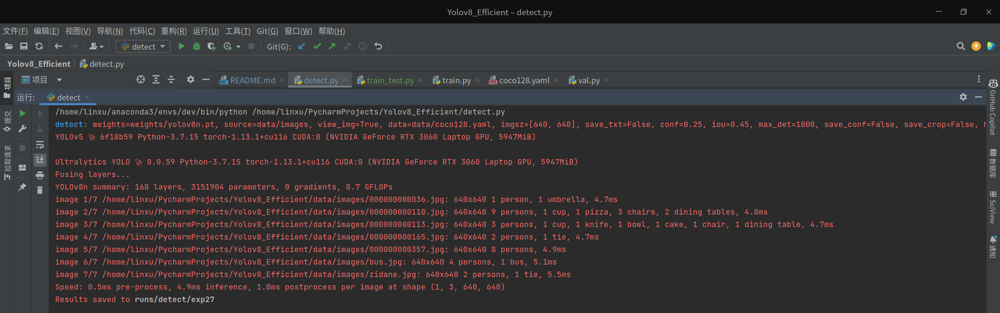


### 验证

- 以coco128为例:

>| 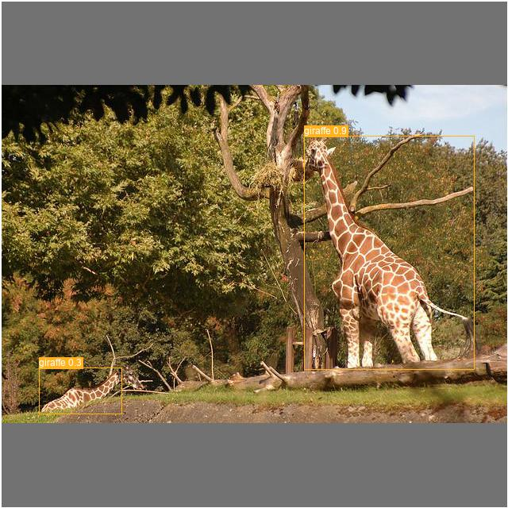 | 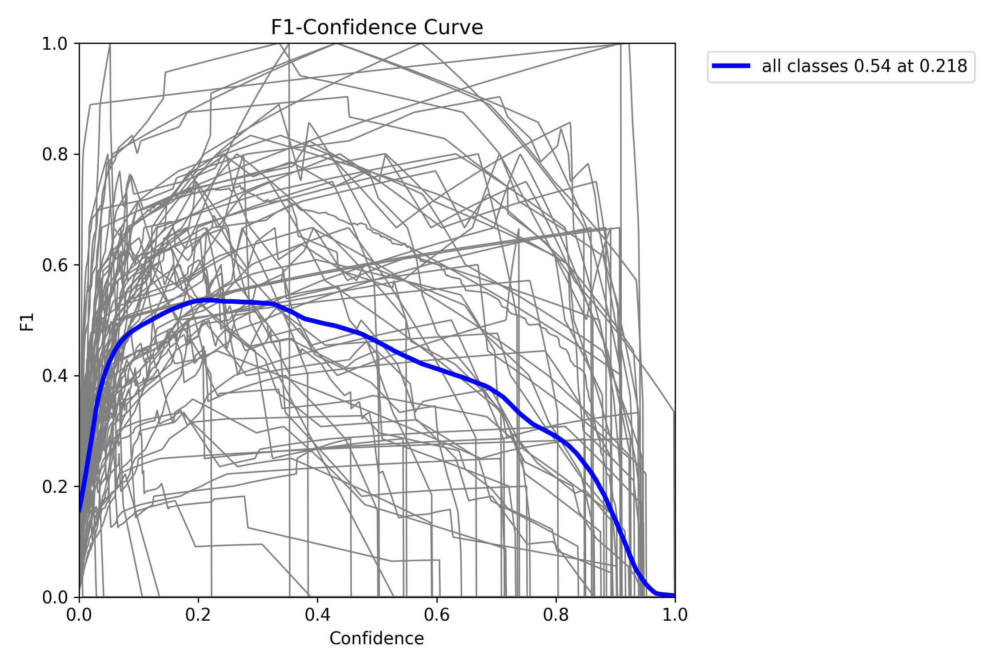 | 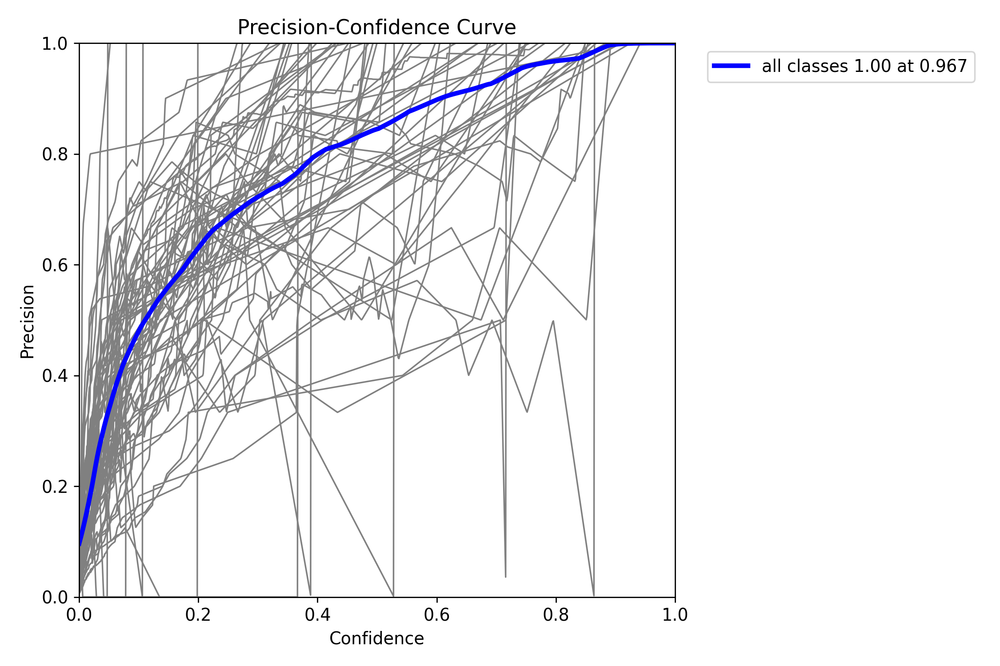          |
> | ------------------------------ | ----------------------- | ------------------------------- |
>| 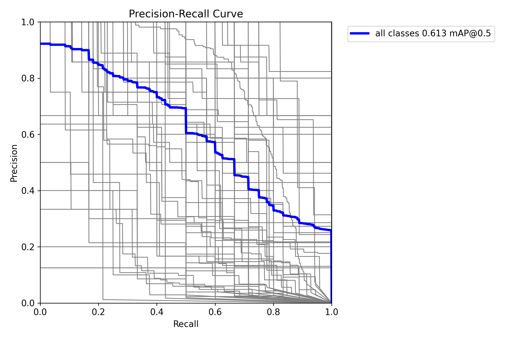        | 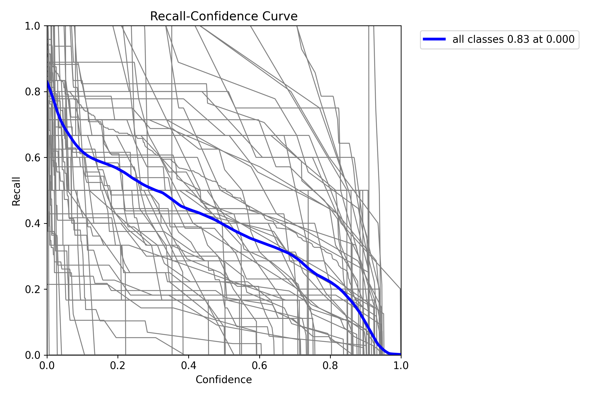  | 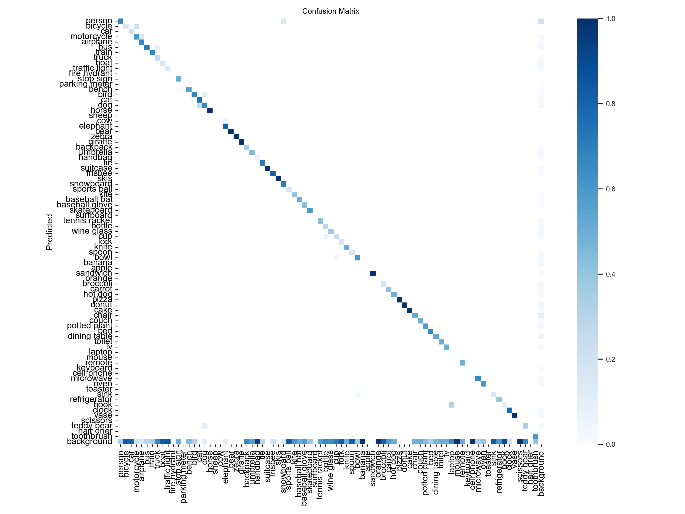 |

#### 用法:

```shell
python val.py --weights yolov8n.pt --data coco128.yaml --img 640
```

#### 用法 - 格式:


```shell
python val.py --weights yolov8s.pt                 # PyTorch
                              yolov8s.torchscript        # TorchScript
                              yolov8s.onnx               # ONNX Runtime or OpenCV DNN with --dnn
                              yolov8s_openvino_model     # OpenVINO
                              yolov8s.engine             # TensorRT
                              yolov8s.mlmodel            # CoreML (macOS-only)
                              yolov8s_saved_model        # TensorFlow SavedModel
                              yolov8s.pb                 # TensorFlow GraphDef
                              yolov8s.tflite             # TensorFlow Lite
                              yolov8s_edgetpu.tflite     # TensorFlow Edge TPU
                              yolov8s_paddle_model       # PaddlePaddle
```

> 使用 IDE Pycharm
> 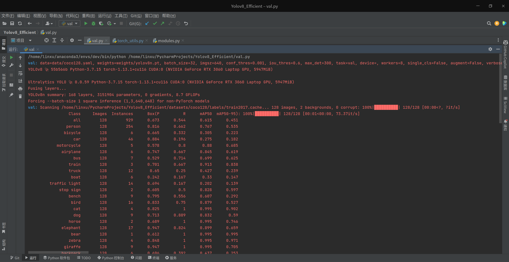


## 🌹致谢
- [https://github.com/ultralytics/yolov3](https://github.com/ultralytics/yolov3)
- [https://github.com/ultralytics/yolov5](https://github.com/ultralytics/yolov5)
- https://github.com/meituan/YOLOv6
- https://github.com/WongKinYiu/yolov7

